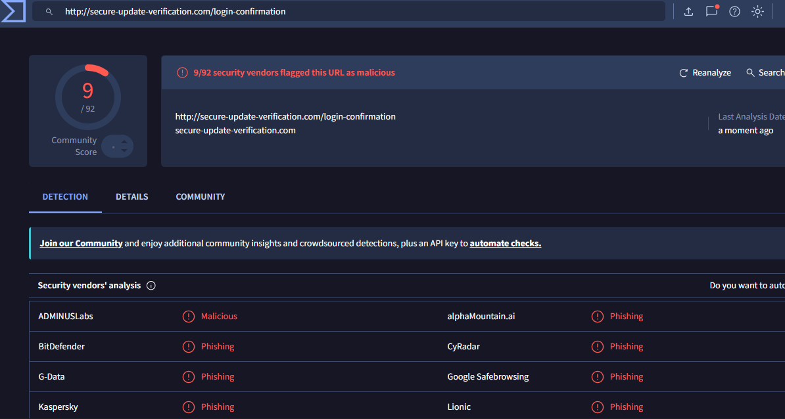

# Lab 4 --- Phishing Investigation

## Task 1 --- Analyse a Suspicious Email

>**Subject**: ⚠ Urgent: Your Account Will Be Locked in 24 Hours!
>
>**From**: Security Team <support@secure-verification-update.com>
>
>**To**: you@example.com
>
>Hello User,
>
>We detected unusual activity on your account. For your security, your access will be temporarily suspended within 24 hours unless you verify your information.
>
>Please click the link below to avoid interruption:
>
>👉 Verify Your Account Now
[http://secure-update-verification.com/login-confirmation](https://secure-update.verify-account-check.example.com/login/redirect/authentication_step2/?sessionid=3f9a2b8c7d1e44aa92f1b0f8f&token=invalid123456789&continue=http%3A%2F%2Fupdate-alert-confirmation.example.net%2Fverify%2Fuser%2Fsecurity%2Fcheck%2F?id=889201&source=email_warning)
>
>Failure to verify may result in permanent loss of access and data.
If you believe this is a mistake, reply with your full name, date of birth, and password so we can assist you.
>
>**Thank you,**
>
>**Account Support Team**
>
>**Security Department**

### Questions

1.  Who appears to be the sender?
“Security Team” with email address support@secure-verification-update.com. The name tries to look official, but the domain is suspicious.
3.  Does the email create urgency or pressure?
	Yes — it says account will be locked in 24 hours and threatens permanent loss of access and data, which pressures the user to act quickly without thinking.
5.  Are there spelling or grammar mistakes?
   Minor issues — “⚠” emoji in subject line is unprofessional; otherwise, it’s fairly clean, which is common in modern phishing. The request to reply with password is a major red flag, not a grammar error.
7.  Does the link match the organisation domain?
No — the link is http://secure-update-verification.com/login-confirmation (fake domain), not a real company’s domain (e.g., company.com). Also uses HTTP, not HTTPS.
### Reflection

Explain why attackers use phishing emails.

------------------------------------------------------------------------

## Task 2 --- Link Inspection

Hover over the link in the email (or copy link) and inspect the URL.

### Screenshot

### Questions

1.  Does the displayed link match the actual URL?
   No — the visible text says “Verify Your Account Now” but the actual link is a different URL. This is a classic hyperlink mismatch.
3.  Are there unusual domain names?
   Yes — secure-update-verification.com is not a well-known company domain. It’s long, uses hyphens, and mimics security-related words to appear trustworthy. Legitimate companies usually use a simple, consistent domain.
### Reflection

Explain why users should always inspect links before clicking them.
Users should inspect links before clicking because phishing attacks rely on fake links that appear legitimate at first glance. By hovering over a link (or long-pressing on mobile), you can see the real destination. This simple check helps detect mismatched domains, misspelled company names, unusual top-level domains (e.g., .xyz, .top), or non-HTTPS links. Clicking without inspection can lead to credential theft, malware downloads, or ransomware infection. One wrong click can compromise an entire organization.

